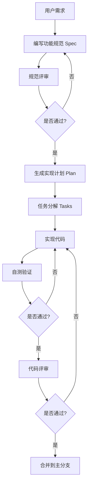

# EPC 项目管理系统 - 项目宪法 (Constitution)

## 📋 项目概述

**项目名称**: EPC 项目管理系统 (EPC Project Management System)  
**版本**: 2.0.0-Canvas  
**技术栈**: React + TypeScript + FastAPI + SQLite  
**开发方法**: Spec-Driven Development (SDD)

---

## 🎯 核心原则

### 1. **用户体验至上 (User Experience First)**

- 所有功能必须从用户需求出发，而非技术驱动
- 界面必须简洁、直观、响应迅速
- 交互反馈必须即时且清晰
- 移动端和桌面端都要考虑

**示例**: 甘特图的横向滚动、定位功能、悬浮提示都是为了提升用户体验

### 2. **规范先行 (Specification First)**

- 任何新功能必须先编写详细的功能规范 (Spec)
- 规范必须包含：用户故事、验收标准、技术约束
- 规范必须经过评审和批准才能进入实现阶段
- 实现必须严格遵循规范，不得擅自添加功能

**禁止**: 未经规范直接开始编码

### 3. **渐进式实现 (Incremental Implementation)**

- 大功能必须分解为多个小任务
- 每个任务必须独立可测试、可交付
- 优先实现核心功能，后续迭代增强
- 支持并行开发，但要明确依赖关系

**示例**: 甘特图分解为：Canvas 绘制 → 交互功能 → 导出功能 → 高级功能

### 4. **质量优先 (Quality First)**

- 代码质量高于开发速度
- 必须遵循 TypeScript 类型安全
- 必须处理所有错误情况
- 必须考虑性能优化
- UI 必须响应式且无障碍

**质量标准**:
- ✅ 无 TypeScript 编译错误
- ✅ 无 ESLint 警告（关键级别）
- ✅ 所有异步操作有错误处理
- ✅ 所有用户操作有反馈提示

### 5. **简洁胜于复杂 (Simplicity Over Complexity)**

- 优先使用简单方案，避免过度设计
- 不使用未来可能需要的功能（YAGNI 原则）
- 重构时保持功能不变，优化内部实现
- 依赖库选择成熟稳定的方案

**反面示例**: 不要为"可能的需求"添加复杂的抽象层

### 6. **数据安全与一致性 (Data Safety & Consistency)**

- 用户数据优先保存在本地
- 服务器同步采用乐观更新策略
- 失败时必须有降级方案
- 关键操作必须有二次确认

**实施策略**:
- 添加/编辑任务：立即更新 UI → 后台同步
- 删除操作：二次确认 → 乐观删除 → 后台同步
- 网络失败：保留本地数据 + 友好提示

### 7. **可维护性 (Maintainability)**

- 代码必须清晰易读，命名见名知义
- 复杂逻辑必须有注释说明
- 相关功能集中在一起
- 避免重复代码（DRY 原则）

**代码组织**:
```
src/
  components/     # 可复用组件
  pages/          # 页面组件
  contexts/       # 全局状态管理
  services/       # API 调用服务
  utils/          # 工具函数
```

### 8. **性能优化 (Performance Optimization)**

- 首次加载时间 < 3 秒
- 交互响应时间 < 100ms
- 大数据集必须虚拟化或分页
- 图片和资源必须优化

**性能指标**:
- Canvas 重绘 < 100ms
- API 调用 < 500ms
- 内存占用 < 100MB

---

## 🚫 禁止事项 (Prohibited Actions)

### 1. **严格禁止**

- ❌ 直接修改生产数据库
- ❌ 硬编码敏感信息（密码、密钥）
- ❌ 绕过 Git 工作流（强制推送到 main）
- ❌ 未经测试直接部署到生产环境
- ❌ 删除或修改已有的 API 契约（破坏性变更）

### 2. **需谨慎处理**

- ⚠️ 第三方库升级（必须测试兼容性）
- ⚠️ 数据库架构变更（必须有迁移脚本）
- ⚠️ 大规模重构（必须分步进行）
- ⚠️ 修改核心组件（必须评估影响范围）

---

## 📐 技术约束 (Technical Constraints)

### 前端技术栈

| 技术 | 版本 | 用途 |
|------|------|------|
| React | 18.x | UI 框架 |
| TypeScript | 4.x+ | 类型安全 |
| Ant Design | 5.x | UI 组件库 |
| Three.js | 最新 | 3D 可视化 |
| dayjs | 最新 | 日期处理 |
| xlsx | 最新 | Excel 导入导出 |
| jspdf | 最新 | PDF 导出 |

### 后端技术栈

| 技术 | 版本 | 用途 |
|------|------|------|
| Python | 3.9+ | 后端语言 |
| FastAPI | 最新 | Web 框架 |
| SQLite | 3.x | 数据库 |
| SQLAlchemy | 最新 | ORM |
| Uvicorn | 最新 | ASGI 服务器 |

### 浏览器支持

- ✅ Chrome 90+
- ✅ Edge 90+
- ✅ Firefox 88+
- ⚠️ Safari 14+ (部分功能受限)
- ❌ IE 11 及以下

---

## 🔄 开发工作流 (Development Workflow)

### 新功能开发流程



### 分支策略

- **main**: 生产环境分支（受保护）
- **develop**: 开发分支（受保护）
- **feature/功能名**: 功能开发分支
- **bugfix/问题名**: 缺陷修复分支
- **hotfix/紧急修复**: 生产环境紧急修复

### 提交规范

```
<type>(<scope>): <subject>

<body>

<footer>
```

**Type**:
- `feat`: 新功能
- `fix`: 缺陷修复
- `refactor`: 重构
- `style`: 样式调整
- `docs`: 文档更新
- `perf`: 性能优化
- `test`: 测试相关
- `chore`: 构建/工具链

**示例**:
```
feat(gantt): 添加Canvas甘特图横向滚动功能

- 实现横向滚动容器
- 添加定位按钮（今天/本周/起点）
- 优化滚动性能

Closes #123
```

---

## 🎨 UI/UX 设计原则

### 视觉设计

- **字体**: Microsoft YaHei, sans-serif
- **主色调**: 蓝色系 (#1890ff, #3b82f6)
- **成功色**: 绿色 (#10b981)
- **警告色**: 橙色 (#f59e0b)
- **错误色**: 红色 (#ef4444)
- **中性色**: 灰色系 (#1e293b, #64748b, #cbd5e1)

### 间距系统

```css
--spacing-xs: 4px;
--spacing-sm: 8px;
--spacing-md: 16px;
--spacing-lg: 24px;
--spacing-xl: 32px;
```

### 动画时长

```css
--duration-fast: 0.15s;
--duration-base: 0.3s;
--duration-slow: 0.5s;
```

---

## 📊 数据管理原则

### API 设计

- RESTful 风格
- 统一响应格式
- 版本控制（/api/v1/）
- 错误处理标准化

**响应格式**:
```json
{
  "success": true,
  "data": {},
  "error": null,
  "timestamp": "2024-01-20T10:30:00Z"
}
```

### 状态管理

- **全局状态**: React Context (项目、用户)
- **本地状态**: useState (组件内)
- **服务端状态**: React Query (未来考虑)

---

## 🧪 测试策略

### 测试金字塔

```
       /\
      /E2E\      10% - 端到端测试
     /------\
    /  集成  \    20% - 集成测试
   /----------\
  /   单元测试  \  70% - 单元测试
 /--------------\
```

### 测试要求

- 核心业务逻辑必须有单元测试
- 关键用户流程必须有 E2E 测试
- 新功能必须有测试覆盖
- 缺陷修复必须添加回归测试

---

## 🔐 安全原则

### 认证授权

- 使用 JWT Token
- Token 有效期：24 小时
- 敏感操作需要再次验证
- 密码必须加密存储

### 数据保护

- 输入验证（前后端双重）
- SQL 注入防护（使用 ORM）
- XSS 防护（React 自动转义）
- CORS 配置

---

## 📈 性能基准

### 前端性能

| 指标 | 目标值 | 当前值 |
|------|--------|--------|
| 首次内容绘制 (FCP) | < 1.5s | - |
| 最大内容绘制 (LCP) | < 2.5s | - |
| 首次输入延迟 (FID) | < 100ms | - |
| 累积布局偏移 (CLS) | < 0.1 | - |

### 后端性能

| 指标 | 目标值 | 当前值 |
|------|--------|--------|
| API 响应时间 (P95) | < 500ms | - |
| 并发用户数 | 100+ | - |
| 数据库查询时间 | < 100ms | - |

---

## 📝 文档要求

### 必须文档

- ✅ README.md - 项目简介和快速开始
- ✅ API.md - API 文档
- ✅ DEPLOYMENT.md - 部署指南
- ✅ CONTRIBUTING.md - 贡献指南

### 代码注释

- 复杂算法必须注释
- 业务逻辑必须注释
- API 接口必须 JSDoc/Docstring
- 配置文件必须注释

---

## 🎯 迭代计划

### 当前版本 (v2.0.0-Canvas)

- ✅ 甘特图 Canvas 重构
- ✅ 导航栏优化
- ✅ PDF 导出功能
- ✅ 进度颜色区分

### 下一版本 (v2.1.0)

- 📋 任务拖拽调整日期
- 📋 资源分配管理
- 📋 批量操作功能
- 📋 数据导出优化

### 长期规划 (v3.0.0)

- 🎯 AI 智能排程
- 🎯 移动端适配
- 🎯 多用户协同
- 🎯 BIM 模型集成

---

## 🙏 团队协作

### 沟通原则

- 问题优先在团队内讨论
- 重大决策需要团队共识
- 代码评审必须认真负责
- 尊重不同意见，理性讨论

### 知识分享

- 定期技术分享会
- 文档及时更新
- 代码注释清晰
- 问题记录和总结

---

## 📄 版本历史

| 版本 | 日期 | 主要变更 |
|------|------|----------|
| 2.0.0-Canvas | 2024-01 | 甘特图 Canvas 重构 |
| 1.0.0 | 2023-12 | 初始版本发布 |

---

**最后更新**: ${new Date().toLocaleDateString('zh-CN')}  
**维护者**: EPC 项目管理系统开发团队

---

## 附录：AI 开发助手使用指南

本项目采用 **Spec-Driven Development (SDD)** 方法论，配合 AI 助手进行高效开发。

### 与 AI 助手协作的最佳实践

1. **明确需求** → 先描述用户需求，而非技术实现
2. **遵循规范** → 让 AI 基于项目宪法生成方案
3. **迭代优化** → 不满意立即反馈，持续改进
4. **验证质量** → AI 生成的代码必须经过人工审查

### 推荐 AI 工具

- **Claude Code** - 用于规范编写和代码生成
- **GitHub Copilot** - 用于日常编码辅助
- **ChatGPT** - 用于技术问题解答

---

**遵循本宪法，构建卓越的 EPC 项目管理系统！** 🚀


