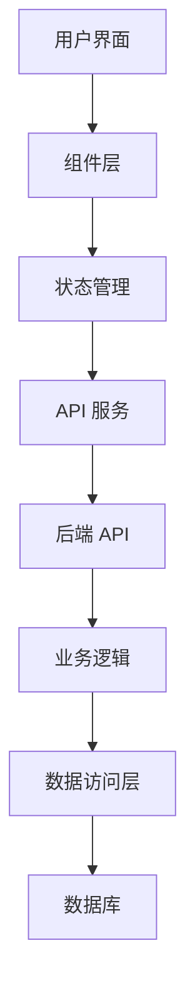

# 实现计划: [功能名称]

**计划ID**: PLAN-[编号]  
**关联规范**: SPEC-[编号]  
**创建日期**: [日期]  
**预计工期**: [N] 天  
**状态**: 草稿 / 评审中 / 已批准 / 实施中 / 已完成

---

## 1. 总体架构 (Architecture Overview)

### 1.1 系统架构图

```
┌──────────────────────────────────────────┐
│           前端 (React + TS)               │
│  ┌────────────┐  ┌────────────┐          │
│  │ Components │  │   Pages    │          │
│  └────────────┘  └────────────┘          │
│  ┌────────────┐  ┌────────────┐          │
│  │  Contexts  │  │  Services  │          │
│  └────────────┘  └────────────┘          │
└──────────────┬───────────────────────────┘
               │ HTTP/WebSocket
┌──────────────┴───────────────────────────┐
│          后端 (FastAPI + Python)          │
│  ┌────────────┐  ┌────────────┐          │
│  │    API     │  │  Services  │          │
│  └────────────┘  └────────────┘          │
│  ┌────────────┐  ┌────────────┐          │
│  │   Models   │  │  Database  │          │
│  └────────────┘  └────────────┘          │
└──────────────────────────────────────────┘
```

### 1.2 组件关系



### 1.3 数据流

1. 用户操作 → 组件事件
2. 组件事件 → 状态更新
3. 状态更新 → API 调用
4. API 调用 → 后端处理
5. 后端处理 → 数据库操作
6. 数据库返回 → API 响应
7. API 响应 → 状态更新
8. 状态更新 → UI 渲染

---

## 2. 技术方案 (Technical Solution)

### 2.1 前端实现

#### 2.1.1 组件设计

**主组件**: `[ComponentName].tsx`
```typescript
interface [ComponentName]Props {
  // 属性定义
}

const [ComponentName]: React.FC<[ComponentName]Props> = ({ ... }) => {
  // 状态管理
  const [state, setState] = useState<T>(initialState);
  
  // 副作用
  useEffect(() => {
    // 初始化
  }, []);
  
  // 事件处理
  const handleAction = useCallback(async () => {
    try {
      // 业务逻辑
    } catch (error) {
      // 错误处理
    }
  }, [dependencies]);
  
  return (
    // JSX
  );
};
```

**子组件**:
- `[SubComponent1].tsx`: [描述]
- `[SubComponent2].tsx`: [描述]

#### 2.1.2 状态管理策略

**本地状态** (useState):
- `[state1]`: [用途]
- `[state2]`: [用途]

**全局状态** (Context):
- `[context1]`: [用途]
- `[context2]`: [用途]

**服务端状态** (API 调用):
- `[endpoint1]`: [用途]
- `[endpoint2]`: [用途]

#### 2.1.3 性能优化

- [ ] 使用 `React.memo` 包裹纯组件
- [ ] 使用 `useMemo` 缓存计算结果
- [ ] 使用 `useCallback` 缓存回调函数
- [ ] 实现虚拟滚动（如果需要）
- [ ] 懒加载非关键组件

#### 2.1.4 样式实现

```css
/* [ComponentName].css */
.[component-name] {
  /* 容器样式 */
}

.[component-name]__element {
  /* 元素样式 */
}

.[component-name]--modifier {
  /* 修饰符样式 */
}
```

### 2.2 后端实现

#### 2.2.1 数据模型

**文件**: `server/app/models/[model_name].py`

```python
from sqlalchemy import Column, String, Integer, DateTime, ForeignKey
from sqlalchemy.orm import relationship
from datetime import datetime
from .base import Base

class [ModelName](Base):
    __tablename__ = "[table_name]"
    
    # 主键
    id = Column(String, primary_key=True, index=True)
    
    # 字段
    name = Column(String, nullable=False, index=True)
    description = Column(String)
    
    # 时间戳
    created_at = Column(DateTime, default=datetime.utcnow)
    updated_at = Column(DateTime, default=datetime.utcnow, onupdate=datetime.utcnow)
    
    # 外键
    user_id = Column(String, ForeignKey("users.id"))
    
    # 关系
    user = relationship("User", back_populates="[related]")
```

#### 2.2.2 业务逻辑

**文件**: `server/app/services/[service_name].py`

```python
from sqlalchemy.orm import Session
from typing import List, Optional
from ..models.[model_name] import [ModelName]
from ..schemas.[schema_name] import [SchemaName]

class [ServiceName]:
    @staticmethod
    async def get_all(
        db: Session,
        skip: int = 0,
        limit: int = 100
    ) -> List[[ModelName]]:
        """获取所有记录"""
        return db.query([ModelName]).offset(skip).limit(limit).all()
    
    @staticmethod
    async def get_by_id(
        db: Session,
        id: str
    ) -> Optional[[ModelName]]:
        """根据ID获取记录"""
        return db.query([ModelName]).filter([ModelName].id == id).first()
    
    @staticmethod
    async def create(
        db: Session,
        data: [SchemaName]
    ) -> [ModelName]:
        """创建新记录"""
        db_obj = [ModelName](**data.dict())
        db.add(db_obj)
        db.commit()
        db.refresh(db_obj)
        return db_obj
    
    @staticmethod
    async def update(
        db: Session,
        id: str,
        data: [SchemaName]
    ) -> Optional[[ModelName]]:
        """更新记录"""
        db_obj = db.query([ModelName]).filter([ModelName].id == id).first()
        if db_obj:
            for key, value in data.dict(exclude_unset=True).items():
                setattr(db_obj, key, value)
            db.commit()
            db.refresh(db_obj)
        return db_obj
    
    @staticmethod
    async def delete(
        db: Session,
        id: str
    ) -> bool:
        """删除记录"""
        db_obj = db.query([ModelName]).filter([ModelName].id == id).first()
        if db_obj:
            db.delete(db_obj)
            db.commit()
            return True
        return False
```

#### 2.2.3 API 端点

**文件**: `server/app/api/[endpoint_name].py`

```python
from fastapi import APIRouter, Depends, HTTPException
from sqlalchemy.orm import Session
from typing import List
from ..database import get_db
from ..services.[service_name] import [ServiceName]
from ..schemas.[schema_name] import [SchemaName]

router = APIRouter(prefix="/api/v1/[resource]", tags=["[Resource]"])

@router.get("/", response_model=List[[SchemaName]])
async def get_resources(
    skip: int = 0,
    limit: int = 100,
    db: Session = Depends(get_db)
):
    """获取资源列表"""
    try:
        return await [ServiceName].get_all(db, skip, limit)
    except Exception as e:
        raise HTTPException(status_code=500, detail=str(e))

@router.get("/{id}", response_model=[SchemaName])
async def get_resource(
    id: str,
    db: Session = Depends(get_db)
):
    """获取单个资源"""
    resource = await [ServiceName].get_by_id(db, id)
    if not resource:
        raise HTTPException(status_code=404, detail="Resource not found")
    return resource

@router.post("/", response_model=[SchemaName])
async def create_resource(
    data: [SchemaName],
    db: Session = Depends(get_db)
):
    """创建新资源"""
    try:
        return await [ServiceName].create(db, data)
    except Exception as e:
        raise HTTPException(status_code=500, detail=str(e))

@router.put("/{id}", response_model=[SchemaName])
async def update_resource(
    id: str,
    data: [SchemaName],
    db: Session = Depends(get_db)
):
    """更新资源"""
    resource = await [ServiceName].update(db, id, data)
    if not resource:
        raise HTTPException(status_code=404, detail="Resource not found")
    return resource

@router.delete("/{id}")
async def delete_resource(
    id: str,
    db: Session = Depends(get_db)
):
    """删除资源"""
    success = await [ServiceName].delete(db, id)
    if not success:
        raise HTTPException(status_code=404, detail="Resource not found")
    return {"message": "Resource deleted successfully"}
```

---

## 3. 数据库设计 (Database Design)

### 3.1 表结构

```sql
CREATE TABLE [table_name] (
    id VARCHAR(50) PRIMARY KEY,
    name VARCHAR(100) NOT NULL,
    description TEXT,
    created_at TIMESTAMP DEFAULT CURRENT_TIMESTAMP,
    updated_at TIMESTAMP DEFAULT CURRENT_TIMESTAMP ON UPDATE CURRENT_TIMESTAMP,
    user_id VARCHAR(50),
    FOREIGN KEY (user_id) REFERENCES users(id)
);

CREATE INDEX idx_[table]_name ON [table_name](name);
CREATE INDEX idx_[table]_user ON [table_name](user_id);
```

### 3.2 数据迁移

**迁移脚本**: `migrations/[timestamp]_[description].sql`

```sql
-- 添加新表
CREATE TABLE IF NOT EXISTS [table_name] (...);

-- 添加新列
ALTER TABLE [existing_table] ADD COLUMN [new_column] VARCHAR(50);

-- 创建索引
CREATE INDEX [index_name] ON [table_name]([column_name]);

-- 数据迁移（如果需要）
UPDATE [table_name] SET [column] = [value] WHERE [condition];
```

### 3.3 数据验证

- 唯一性约束：`id`, `name` (如果需要)
- 非空约束：`name`, `user_id`
- 外键约束：`user_id` → `users.id`
- 默认值：`created_at`, `updated_at`

---

## 4. API 规范 (API Specification)

### 4.1 请求/响应格式

**请求示例**:
```json
POST /api/v1/[resource]
Content-Type: application/json
Authorization: Bearer [token]

{
  "name": "示例名称",
  "description": "示例描述"
}
```

**成功响应**:
```json
HTTP/1.1 201 Created
Content-Type: application/json

{
  "id": "uuid-1234",
  "name": "示例名称",
  "description": "示例描述",
  "created_at": "2024-01-20T10:00:00Z",
  "updated_at": "2024-01-20T10:00:00Z"
}
```

**错误响应**:
```json
HTTP/1.1 400 Bad Request
Content-Type: application/json

{
  "detail": "Validation error",
  "errors": [
    {
      "field": "name",
      "message": "Name is required"
    }
  ]
}
```

### 4.2 API 端点清单

| 方法 | 端点 | 描述 | 请求 | 响应 |
|------|------|------|------|------|
| GET | `/api/v1/[resource]` | 获取列表 | Query: skip, limit | `[Resource][]` |
| GET | `/api/v1/[resource]/{id}` | 获取详情 | Path: id | `[Resource]` |
| POST | `/api/v1/[resource]` | 创建 | Body: `[Resource]` | `[Resource]` |
| PUT | `/api/v1/[resource]/{id}` | 更新 | Path: id, Body: `[Resource]` | `[Resource]` |
| DELETE | `/api/v1/[resource]/{id}` | 删除 | Path: id | `{message}` |

---

## 5. 依赖关系 (Dependencies)

### 5.1 前端依赖

**新增依赖** (如果需要):
```json
{
  "dependencies": {
    "[package-name]": "^[version]"
  }
}
```

**原因**: [说明为什么需要这个依赖]

### 5.2 后端依赖

**新增依赖** (如果需要):
```
[package-name]==[version]  # [说明用途]
```

### 5.3 内部依赖

此功能依赖于以下现有功能：
- [ ] [功能 A] 必须先实现
- [ ] [功能 B] 必须先实现
- [ ] [配置 C] 必须先完成

---

## 6. 实施步骤 (Implementation Steps)

### 阶段 1: 数据层 (1 天)

**任务**:
1. 创建数据模型 (`models/[model_name].py`)
2. 创建数据库迁移脚本
3. 运行迁移，验证表结构
4. 编写模型单元测试

**验收标准**:
- [ ] 数据模型定义正确
- [ ] 迁移脚本运行成功
- [ ] 单元测试通过

### 阶段 2: 业务逻辑层 (1-2 天)

**任务**:
1. 实现服务类 (`services/[service_name].py`)
2. 实现 CRUD 操作
3. 实现业务逻辑
4. 编写服务层单元测试

**验收标准**:
- [ ] 所有 CRUD 操作正常
- [ ] 业务逻辑正确
- [ ] 单元测试通过

### 阶段 3: API 层 (1 天)

**任务**:
1. 创建 API 路由 (`api/[endpoint_name].py`)
2. 实现 RESTful 端点
3. 添加请求验证
4. 添加错误处理
5. 编写 API 集成测试

**验收标准**:
- [ ] 所有端点可访问
- [ ] 请求验证正常
- [ ] 错误处理完善
- [ ] 集成测试通过

### 阶段 4: 前端组件 (2-3 天)

**任务**:
1. 创建组件结构
2. 实现 UI 布局
3. 实现状态管理
4. 集成 API 调用
5. 添加错误处理
6. 编写组件测试

**验收标准**:
- [ ] UI 显示正确
- [ ] 交互流畅
- [ ] API 集成正常
- [ ] 错误处理完善
- [ ] 组件测试通过

### 阶段 5: 集成测试 (1 天)

**任务**:
1. 端到端测试
2. 跨浏览器测试
3. 性能测试
4. 用户验收测试

**验收标准**:
- [ ] 所有用户故事满足
- [ ] 性能符合要求
- [ ] 无阻塞性缺陷

### 阶段 6: 文档和部署 (0.5 天)

**任务**:
1. 更新 API 文档
2. 更新用户文档
3. 代码评审
4. 部署到测试环境
5. 部署到生产环境

**验收标准**:
- [ ] 文档完整
- [ ] 代码评审通过
- [ ] 部署成功

---

## 7. 风险评估 (Risk Assessment)

| 风险 | 概率 | 影响 | 缓解措施 |
|------|------|------|----------|
| 技术难度高 | 中 | 高 | 提前技术调研，准备备选方案 |
| 依赖功能延期 | 低 | 中 | 并行开发，模拟数据测试 |
| 性能不达标 | 中 | 高 | 早期性能测试，优化关键路径 |
| 需求变更 | 中 | 中 | 迭代开发，保持灵活性 |

---

## 8. 质量保证 (Quality Assurance)

### 8.1 代码质量

- [ ] TypeScript 无编译错误
- [ ] ESLint 无警告（关键级别）
- [ ] 代码格式符合规范
- [ ] 命名清晰易懂
- [ ] 注释恰当充分

### 8.2 测试覆盖率

- 单元测试覆盖率 >= 70%
- 集成测试覆盖关键流程
- E2E 测试覆盖用户路径

### 8.3 性能基准

- 首次加载时间 < 3 秒
- API 响应时间 < 500ms
- 交互响应时间 < 100ms

---

## 9. 部署计划 (Deployment Plan)

### 9.1 部署环境

| 环境 | 用途 | URL |
|------|------|-----|
| 开发 | 日常开发 | http://localhost:3000 |
| 测试 | 功能测试 | http://test.example.com |
| 预发布 | 上线前验证 | http://staging.example.com |
| 生产 | 正式环境 | http://example.com |

### 9.2 部署步骤

1. **准备阶段**:
   - [ ] 代码合并到主分支
   - [ ] 运行完整测试套件
   - [ ] 构建生产版本
   - [ ] 准备数据库迁移脚本

2. **部署阶段**:
   - [ ] 备份生产数据库
   - [ ] 运行数据库迁移
   - [ ] 部署后端服务
   - [ ] 部署前端应用
   - [ ] 验证部署结果

3. **监控阶段**:
   - [ ] 监控错误日志
   - [ ] 监控性能指标
   - [ ] 监控用户反馈
   - [ ] 准备回滚方案

### 9.3 回滚计划

如果部署失败或出现严重问题：
1. 立即停止新版本
2. 恢复数据库备份
3. 部署上一个稳定版本
4. 通知相关人员
5. 分析问题原因

---

## 10. 后续优化 (Future Optimizations)

### 10.1 性能优化

- [ ] 实现缓存策略
- [ ] 优化数据库查询
- [ ] 实现懒加载
- [ ] 压缩静态资源

### 10.2 功能增强

- [ ] [增强功能 A]
- [ ] [增强功能 B]
- [ ] [增强功能 C]

### 10.3 技术债务

记录需要后续处理的技术债务：
- [技术债务 A]: [描述]
- [技术债务 B]: [描述]

---

## 11. 参考资料 (References)

- [相关规范文档]
- [设计稿链接]
- [技术文档链接]
- [第三方库文档]

---

## 12. 审查和批准 (Review & Approval)

### 12.1 审查清单

- [ ] 技术方案可行
- [ ] 架构设计合理
- [ ] 实施步骤清晰
- [ ] 风险评估充分
- [ ] 时间估算合理
- [ ] 质量标准明确

### 12.2 批准

| 角色 | 姓名 | 状态 | 日期 |
|------|------|------|------|
| 技术负责人 | | ⏳ 待批准 | |
| 架构师 | | ⏳ 待批准 | |
| 项目经理 | | ⏳ 待批准 | |

---

**下一步**: 计划批准后，使用 `tasks-template.md` 生成任务分解


