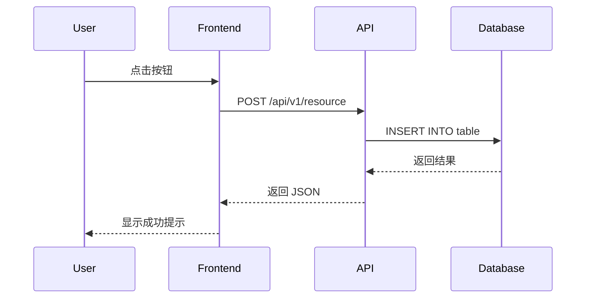

# 功能规范: [功能名称]

**规范ID**: SPEC-[编号]  
**创建日期**: [日期]  
**创建者**: [姓名]  
**状态**: 草稿 / 评审中 / 已批准 / 已实现  
**优先级**: 高 / 中 / 低

---

## 1. 概述 (Overview)

### 1.1 功能描述

简要描述这个功能是什么，它解决什么问题。

### 1.2 业务价值

- 为什么需要这个功能？
- 它带来什么价值？
- 对用户/业务的影响是什么？

### 1.3 目标用户

- 谁会使用这个功能？
- 他们的角色是什么？
- 他们的技术水平如何？

---

## 2. 用户故事 (User Stories)

### 故事 #1: [标题]

**作为** [角色]，  
**我想要** [功能]，  
**以便** [目的/收益]

**验收标准**:
- [ ] Given [前提条件]，When [操作]，Then [预期结果]
- [ ] Given [前提条件]，When [操作]，Then [预期结果]

### 故事 #2: [标题]

**作为** [角色]，  
**我想要** [功能]，  
**以便** [目的/收益]

**验收标准**:
- [ ] Given [前提条件]，When [操作]，Then [预期结果]

---

## 3. UI/UX 设计 (User Interface)

### 3.1 页面布局

描述页面结构，或附上设计稿。

```
┌─────────────────────────────────────────┐
│ Header                                  │
├─────────────────────────────────────────┤
│ Sidebar │ Main Content Area             │
│         │                               │
│         │                               │
│         │                               │
└─────────────────────────────────────────┘
```

### 3.2 关键交互

1. **[交互名称]**
   - 触发条件：
   - 交互流程：
   - 视觉反馈：

### 3.3 样式规范

- 颜色：
- 字体：
- 间距：
- 动画：

---

## 4. 技术要求 (Technical Requirements)

### 4.1 前端实现

#### 4.1.1 组件结构

```
src/
  components/
    [功能名称]/
      index.tsx
      [子组件].tsx
      types.ts
      styles.css
```

#### 4.1.2 状态管理

- 全局状态：
- 本地状态：
- 服务端状态：

#### 4.1.3 API 调用

| 端点 | 方法 | 请求 | 响应 | 描述 |
|------|------|------|------|------|
| `/api/v1/[resource]` | GET | - | `[Resource][]` | 获取列表 |
| `/api/v1/[resource]/{id}` | GET | - | `[Resource]` | 获取详情 |
| `/api/v1/[resource]` | POST | `[Resource]` | `[Resource]` | 创建 |
| `/api/v1/[resource]/{id}` | PUT | `[Resource]` | `[Resource]` | 更新 |
| `/api/v1/[resource]/{id}` | DELETE | - | - | 删除 |

### 4.2 后端实现

#### 4.2.1 数据模型

```python
class [Model](Base):
    __tablename__ = "[table_name]"
    
    id = Column(String, primary_key=True)
    name = Column(String, nullable=False)
    created_at = Column(DateTime, default=datetime.utcnow)
    updated_at = Column(DateTime, onupdate=datetime.utcnow)
    
    # 关系
    # items = relationship("[RelatedModel]", back_populates="parent")
```

#### 4.2.2 API 端点

```python
@router.get("/[resource]/")
async def get_resources(
    skip: int = 0,
    limit: int = 100,
    db: Session = Depends(get_db)
) -> List[ResourceSchema]:
    """获取资源列表"""
    pass
```

#### 4.2.3 业务逻辑

描述核心业务逻辑和算法。

---

## 5. 数据流 (Data Flow)



---

## 6. 非功能性需求 (Non-Functional Requirements)

### 6.1 性能要求

- 页面加载时间：< 3 秒
- API 响应时间：< 500ms
- 并发用户数：100+
- 数据量支持：10,000+ 记录

### 6.2 安全要求

- 认证方式：JWT Token
- 权限控制：基于角色
- 数据加密：HTTPS
- 输入验证：前后端双重

### 6.3 可访问性

- WCAG 2.1 AA 级别
- 键盘导航支持
- 屏幕阅读器兼容
- 颜色对比度 >= 4.5:1

### 6.4 浏览器兼容性

- Chrome 90+
- Edge 90+
- Firefox 88+
- Safari 14+

### 6.5 响应式设计

- 桌面端：1920x1080
- 平板端：768x1024
- 移动端：375x667

---

## 7. 错误处理 (Error Handling)

### 7.1 用户输入错误

| 场景 | 验证规则 | 错误信息 |
|------|----------|----------|
| 必填字段为空 | `required` | "请输入[字段名]" |
| 格式不正确 | `pattern` | "[字段名]格式不正确" |
| 长度超限 | `maxLength` | "[字段名]不能超过[N]个字符" |

### 7.2 API 错误

| HTTP 状态码 | 场景 | 处理方式 |
|------------|------|----------|
| 400 | 请求参数错误 | 显示具体错误信息 |
| 401 | 未授权 | 跳转到登录页 |
| 403 | 无权限 | 显示权限不足提示 |
| 404 | 资源不存在 | 显示友好的 404 页面 |
| 500 | 服务器错误 | 显示通用错误提示 |

### 7.3 降级方案

如果主要功能不可用：
- 显示缓存数据
- 提供离线模式
- 引导用户使用替代方案

---

## 8. 测试计划 (Testing Plan)

### 8.1 单元测试

- [ ] 组件渲染测试
- [ ] 状态更新测试
- [ ] 工具函数测试
- [ ] API 调用测试

### 8.2 集成测试

- [ ] 用户流程测试
- [ ] API 集成测试
- [ ] 数据库操作测试

### 8.3 E2E 测试

- [ ] 关键用户路径
- [ ] 跨浏览器测试
- [ ] 性能测试

### 8.4 手动测试清单

- [ ] UI 显示正确
- [ ] 交互流畅
- [ ] 错误提示清晰
- [ ] 边界情况处理
- [ ] 性能符合要求

---

## 9. 限制和约束 (Constraints)

### 9.1 技术限制

- 必须使用现有技术栈
- 不能引入破坏性变更
- 必须向后兼容

### 9.2 时间限制

- 开发时间：[N] 天
- 测试时间：[N] 天
- 上线时间：[日期]

### 9.3 资源限制

- 开发人员：[N] 人
- 预算：[金额]
- 服务器资源：[配置]

---

## 10. 依赖关系 (Dependencies)

### 10.1 前置条件

在开始开发前，必须完成：
- [ ] [依赖功能 A] 已实现
- [ ] [依赖功能 B] 已实现
- [ ] [第三方服务] 已配置

### 10.2 阻塞项

以下因素可能阻塞开发：
- [外部依赖]
- [资源限制]
- [技术风险]

---

## 11. 未来扩展 (Future Enhancements)

### 11.1 V1.0 范围外

以下功能不在当前版本中，但未来可能添加：
- [功能 A]
- [功能 B]
- [功能 C]

### 11.2 扩展点

代码中预留的扩展点：
- [扩展点 A]: [描述]
- [扩展点 B]: [描述]

---

## 12. 审查和批准 (Review & Approval)

### 12.1 审查清单

在批准规范前，检查以下项：

- [ ] 需求明确且完整
- [ ] 用户故事清晰
- [ ] 验收标准可测试
- [ ] 技术方案可行
- [ ] 性能要求合理
- [ ] 错误处理完善
- [ ] 测试计划充分
- [ ] 时间估算合理

### 12.2 审查者

| 角色 | 姓名 | 状态 | 日期 | 备注 |
|------|------|------|------|------|
| 产品经理 | | ⏳ 待审查 | | |
| 技术负责人 | | ⏳ 待审查 | | |
| UI/UX 设计师 | | ⏳ 待审查 | | |
| 开发工程师 | | ⏳ 待审查 | | |

### 12.3 批准

- [ ] 规范已获得所有必要审查者的批准
- [ ] 所有反馈已处理
- [ ] 可以进入实现阶段

---

## 13. 变更历史 (Change Log)

| 版本 | 日期 | 变更内容 | 变更人 |
|------|------|----------|--------|
| 0.1 | [日期] | 初始草稿 | [姓名] |
| 0.2 | [日期] | 根据反馈修改 | [姓名] |
| 1.0 | [日期] | 正式批准 | [姓名] |

---

## 附录 A: 相关文档

- [需求文档链接]
- [设计稿链接]
- [技术方案文档链接]

## 附录 B: 术语表

| 术语 | 定义 |
|------|------|
| [术语 A] | [定义] |
| [术语 B] | [定义] |

---

**注意**: 
- 本模板仅供参考，根据实际需求调整
- 删除不适用的章节
- 添加项目特定的章节
- 保持规范简洁明了

**下一步**: 规范批准后，使用 `plan-template.md` 生成实现计划


