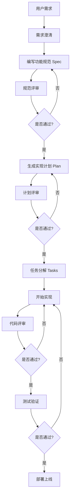

# EPC 项目管理系统 - AI 驱动开发指南

**基于 GitHub Spec-Kit 方法论**

---

## 📚 目录

1. [概述](#概述)
2. [快速开始](#快速开始)
3. [开发工作流](#开发工作流)
4. [文档结构](#文档结构)
5. [最佳实践](#最佳实践)
6. [常见问题](#常见问题)

---

## 概述

本项目采用 **Spec-Driven Development (SDD)** 方法论，借鉴 GitHub spec-kit 的最佳实践，通过 AI 助手（如 Claude Code、GitHub Copilot）进行高效、高质量的软件开发。

### 核心理念

```
规范先行 → 计划制定 → 任务分解 → 代码实现 → 测试验证
```

**关键原则**:
- ✅ **先规范后编码**: 禁止在没有规范的情况下直接编码
- ✅ **质量优先**: 代码质量高于开发速度
- ✅ **AI 辅助**: 充分利用 AI 助手提升效率
- ✅ **迭代开发**: 小步快跑，持续改进

### 项目文档结构

```
.ai-rules/
├── constitution.md         # 项目宪法（最高优先级）
├── CLAUDE.md              # AI 助手配置
└── templates/             # 模板目录
    ├── spec-template.md   # 功能规范模板
    ├── plan-template.md   # 实现计划模板
    └── tasks-template.md  # 任务分解模板
```

---

## 快速开始

### 步骤 1: 阅读项目宪法

在开始任何开发工作前，**必须**先阅读并理解项目宪法：

```bash
# 打开项目宪法
cat .ai-rules/constitution.md
```

**关键内容**:
- 核心开发原则
- 技术栈约束
- 质量标准
- 禁止事项

### 步骤 2: 配置 AI 助手

如果使用 Claude Code 或其他 AI 助手，让它阅读配置文件：

**提示词示例**:
```
请阅读 .ai-rules/CLAUDE.md 和 .ai-rules/constitution.md 文件，
理解本项目的开发规范和工作流程。在后续开发中，你必须严格遵循这些规范。
```

### 步骤 3: 开始第一个功能

**提示词示例**:
```
我想添加一个任务标签功能，允许用户给任务添加多个标签用于分类。
请按照 Spec-Driven Development 流程，帮我编写功能规范。
```

AI 助手将引导你完成整个开发流程。

---

## 开发工作流

### 完整流程图



### 阶段 1: 需求澄清

**目标**: 确保需求清晰明确

**AI 提示词**:
```
我有一个需求：[描述需求]

请帮我澄清以下问题：
1. 这个功能的核心价值是什么？
2. 目标用户是谁？
3. 成功的标准是什么？
4. 有哪些技术约束？
```

**输出**: 清晰的需求描述

---

### 阶段 2: 编写功能规范

**目标**: 生成详细的功能规范文档

**AI 提示词**:
```
基于我们刚才澄清的需求，请使用 .ai-rules/templates/spec-template.md 模板，
为这个功能编写详细的功能规范。

规范应包括：
- 用户故事
- 验收标准
- UI/UX 设计
- 技术要求
- API 规范
- 测试计划
```

**输出**: `specs/[编号]-[功能名]/spec.md`

**评审清单**:
- [ ] 需求明确且完整
- [ ] 用户故事清晰
- [ ] 验收标准可测试
- [ ] 技术方案可行
- [ ] 性能要求合理
- [ ] 错误处理完善

---

### 阶段 3: 生成实现计划

**目标**: 制定详细的技术实现方案

**AI 提示词**:
```
基于功能规范，请使用 .ai-rules/templates/plan-template.md 模板，
生成详细的实现计划。

计划应包括：
- 架构设计
- 技术方案
- 数据库设计
- API 规范
- 实施步骤
- 风险评估
```

**输出**: `specs/[编号]-[功能名]/plan.md`

**评审清单**:
- [ ] 架构设计合理
- [ ] 技术方案可行
- [ ] 实施步骤清晰
- [ ] 风险评估充分
- [ ] 时间估算合理

---

### 阶段 4: 任务分解

**目标**: 将实现计划分解为具体的可执行任务

**AI 提示词**:
```
基于实现计划，请使用 .ai-rules/templates/tasks-template.md 模板，
将计划分解为具体的任务。

每个任务应包括：
- 文件路径
- 依赖关系
- 估计时间
- 验收标准
- 是否可并行

请按照依赖关系合理排序任务。
```

**输出**: `specs/[编号]-[功能名]/tasks.md`

---

### 阶段 5: 代码实现

**目标**: 按照任务清单逐步实现功能

**AI 提示词**:
```
现在开始实现任务：[任务编号] - [任务名称]

请严格按照以下要求：
1. 遵循项目宪法的所有规范
2. 确保 TypeScript 类型安全
3. 添加适当的错误处理
4. 编写清晰的注释
5. 遵循现有代码风格

实现后，提供：
- 完整代码
- 测试建议
- 潜在问题说明
```

**最佳实践**:
- 一次只实现一个任务
- 每完成一个任务立即测试
- 遇到问题及时反馈
- 保持代码质量

---

### 阶段 6: 测试验证

**目标**: 确保功能正常且符合规范

**测试清单**:
- [ ] 单元测试通过
- [ ] 集成测试通过
- [ ] 手动测试所有场景
- [ ] 边界情况处理正确
- [ ] 性能符合要求
- [ ] 错误提示清晰

**AI 提示词**:
```
帮我为刚刚实现的功能编写测试用例。

应包括：
1. 正常场景测试
2. 边界情况测试
3. 错误处理测试
4. 性能测试建议
```

---

### 阶段 7: 代码评审

**目标**: 确保代码质量和规范遵循

**评审清单**:
- [ ] 符合项目宪法要求
- [ ] TypeScript 无编译错误
- [ ] ESLint 无警告
- [ ] 代码格式规范
- [ ] 命名清晰易懂
- [ ] 注释恰当充分
- [ ] 无重复代码
- [ ] 性能优化合理

**AI 提示词**:
```
请对以下代码进行评审，检查是否符合项目宪法和最佳实践：

[粘贴代码]

评审重点：
1. 代码质量
2. 性能优化
3. 错误处理
4. 可维护性
5. 安全性
```

---

## 文档结构

### 功能规范 (Spec)

**位置**: `specs/[编号]-[功能名]/spec.md`

**核心内容**:
1. 概述
2. 用户故事
3. UI/UX 设计
4. 技术要求
5. API 规范
6. 非功能性需求
7. 测试计划

**示例**:
```markdown
# 功能规范: 任务标签系统

## 1. 概述
允许用户为任务添加多个标签，便于分类和筛选。

## 2. 用户故事
**作为** 项目经理，
**我想要** 给任务添加标签，
**以便** 更好地分类和管理任务

## 3. 验收标准
- [ ] 可以创建新标签
- [ ] 可以给任务添加多个标签
- [ ] 可以按标签筛选任务
```

### 实现计划 (Plan)

**位置**: `specs/[编号]-[功能名]/plan.md`

**核心内容**:
1. 架构设计
2. 技术方案
3. 数据库设计
4. API 规范
5. 实施步骤
6. 风险评估

**示例**:
```markdown
# 实现计划: 任务标签系统

## 1. 架构设计
多对多关系：Task ↔ Tag

## 2. 数据库设计
- tags 表
- task_tags 关联表

## 3. 实施步骤
### Phase 1: 数据层 (1天)
### Phase 2: API 层 (1天)
### Phase 3: 前端层 (2天)
```

### 任务分解 (Tasks)

**位置**: `specs/[编号]-[功能名]/tasks.md`

**核心内容**:
- 具体任务列表
- 文件路径
- 依赖关系
- 估计时间
- 验收标准

**示例**:
```markdown
# 任务分解: 任务标签系统

## Phase 1: 数据层

### Task 1.1: 创建 Tag 模型
- **文件**: `server/app/models/tag.py`
- **依赖**: 无
- **估时**: 30 分钟
- **验收**: [ ] 模型定义正确
```

---

## 最佳实践

### 1. 与 AI 助手有效协作

#### ✅ 好的提示词

```
我想添加一个任务依赖功能，让用户可以设置任务之间的依赖关系。

请帮我：
1. 澄清需求细节
2. 编写功能规范
3. 评估技术难度
4. 给出实现建议

请基于项目宪法和现有技术栈。
```

#### ❌ 不好的提示词

```
帮我做个依赖功能
```

**区别**:
- 好的提示词明确、具体、有上下文
- 不好的提示词模糊、缺少细节

### 2. 遵循渐进式开发

```
步骤 1: 实现核心功能
步骤 2: 添加基本 UI
步骤 3: 完善交互细节
步骤 4: 性能优化
步骤 5: 增强功能
```

**不要**:
- ❌ 一次实现所有功能
- ❌ 在核心功能完成前添加增强功能
- ❌ 跳过测试直接上线

### 3. 保持代码质量

**代码质量检查清单**:
```typescript
// ✅ 好的示例
interface Task {
  id: string;
  name: string;
  status: 'pending' | 'in_progress' | 'completed';
}

const TaskCard: React.FC<{ task: Task }> = ({ task }) => {
  const [isEditing, setIsEditing] = useState(false);
  
  const handleSave = useCallback(async () => {
    try {
      await saveTask(task);
      message.success('保存成功');
    } catch (error) {
      message.error('保存失败');
    }
  }, [task]);
  
  return <Card>{task.name}</Card>;
};

// ❌ 不好的示例
const TaskCard = (props: any) => {  // 使用 any
  function handleClick() {  // 没有错误处理
    saveTask(props.task);
  }
  return <div>{props.task.name}</div>;
};
```

### 4. 有效的错误处理

```typescript
// ✅ 完善的错误处理
const loadTasks = async () => {
  setLoading(true);
  try {
    const response = await fetch('/api/tasks');
    if (!response.ok) {
      throw new Error(`HTTP ${response.status}`);
    }
    const data = await response.json();
    setTasks(data);
  } catch (error) {
    console.error('加载任务失败:', error);
    message.error('加载失败，请重试');
    // 降级方案：显示缓存数据
    setTasks(cachedTasks);
  } finally {
    setLoading(false);
  }
};

// ❌ 不完善的错误处理
const loadTasks = async () => {
  const data = await fetch('/api/tasks').then(r => r.json());
  setTasks(data);  // 没有错误处理
};
```

### 5. 性能优化

```typescript
// ✅ 性能优化示例
const TaskList: React.FC = () => {
  // 缓存计算结果
  const filteredTasks = useMemo(() => 
    tasks.filter(t => t.status === 'in_progress'),
    [tasks]
  );
  
  // 缓存回调函数
  const handleDelete = useCallback((id: string) => {
    setTasks(tasks.filter(t => t.id !== id));
  }, [tasks]);
  
  // 使用 React.memo 避免不必要的重渲染
  return filteredTasks.map(task => (
    <TaskCard key={task.id} task={task} onDelete={handleDelete} />
  ));
};

const TaskCard = React.memo<{ task: Task; onDelete: (id: string) => void }>(
  ({ task, onDelete }) => {
    return <Card>...</Card>;
  }
);
```

---

## 常见问题

### Q1: 如何处理规范变更？

**A**: 
1. 更新功能规范文档
2. 评估影响范围
3. 更新实现计划
4. 调整任务分解
5. 通知相关人员

### Q2: AI 生成的代码质量如何保证？

**A**:
1. 提供清晰的上下文和要求
2. 要求遵循项目宪法
3. 进行代码评审
4. 运行自动化测试
5. 人工验证关键逻辑

### Q3: 如何处理技术债务？

**A**:
1. 在实现计划中记录技术债务
2. 评估优先级和影响
3. 制定还债计划
4. 在迭代中逐步解决
5. 避免累积过多债务

### Q4: 如何平衡速度和质量？

**A**:
1. 遵循"质量优先"原则
2. 合理设定时间预期
3. 聚焦核心功能
4. 后续迭代增强
5. 不要为了速度牺牲质量

### Q5: 多人协作如何避免冲突？

**A**:
1. 明确分工和责任
2. 使用分支策略
3. 及时沟通进度
4. 定期代码评审
5. 遵循统一规范

---

## 工具推荐

### AI 助手

1. **Claude Code** - 规范编写和代码生成
2. **GitHub Copilot** - 日常编码辅助
3. **ChatGPT** - 技术问题解答

### 开发工具

1. **VS Code** - 代码编辑器
2. **Git** - 版本控制
3. **Postman** - API 测试
4. **Chrome DevTools** - 前端调试

### 质量工具

1. **TypeScript** - 类型检查
2. **ESLint** - 代码检查
3. **Prettier** - 代码格式化
4. **Jest** - 单元测试

---

## 参考资源

### 官方文档

- [GitHub spec-kit](https://github.com/github/spec-kit)
- [React 文档](https://react.dev/)
- [TypeScript 文档](https://www.typescriptlang.org/)
- [FastAPI 文档](https://fastapi.tiangolo.com/)
- [Ant Design 文档](https://ant.design/)

### 学习资源

- **Spec-Driven Development**: [GitHub spec-kit README](https://github.com/github/spec-kit#readme)
- **TypeScript 最佳实践**: [TypeScript Deep Dive](https://basarat.gitbook.io/typescript/)
- **React 性能优化**: [React Performance](https://react.dev/learn/render-and-commit)

---

## 下一步行动

### 立即开始

1. ✅ 阅读项目宪法 (`.ai-rules/constitution.md`)
2. ✅ 配置 AI 助手 (`.ai-rules/CLAUDE.md`)
3. ✅ 选择一个功能开始实践
4. ✅ 按照工作流程逐步进行
5. ✅ 在实践中持续改进

### 持续改进

- 记录遇到的问题和解决方案
- 总结最佳实践
- 更新文档和模板
- 分享经验和知识
- 优化开发流程

---

**记住**: Spec-Driven Development 的核心是**规范先行、质量优先、迭代开发**。

通过与 AI 助手的有效协作，我们可以构建高质量的 EPC 项目管理系统！

**祝开发愉快！** 🚀

---

**最后更新**: ${new Date().toLocaleDateString('zh-CN')}  
**维护者**: EPC 项目管理系统开发团队


